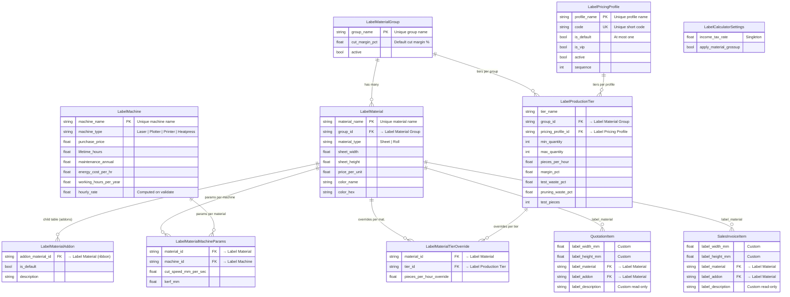

# Entity-Relationship Diagram — Label Calculator

```mermaid
erDiagram
    %% ── Core entities ──────────────────────────────────────────────

    LabelMaterialGroup {
        string group_name PK "Unique group name"
        float cut_margin_pct "Default cut margin %"
        bool active
    }

    LabelMaterial {
        string material_name PK "Unique material name"
        string group_id FK "→ Label Material Group"
        string material_type "Sheet | Roll"
        float sheet_width
        float sheet_height
        float price_per_unit
        string color_name
        string color_hex
    }

    LabelMaterialAddon {
        string addon_material_id FK "→ Label Material (ribbon)"
        bool is_default
        string description
    }

    LabelMachine {
        string machine_name PK "Unique machine name"
        string machine_type "Laser | Plotter | Printer | Heatpress"
        float purchase_price
        float lifetime_hours
        float maintenance_annual
        float energy_cost_per_hr
        float working_hours_per_year
        float hourly_rate "Computed on validate"
    }

    LabelMaterialMachineParams {
        string material_id FK "→ Label Material"
        string machine_id FK "→ Label Machine"
        float cut_speed_mm_per_sec
        float kerf_mm
    }

    LabelPricingProfile {
        string profile_name PK "Unique profile name"
        string code UK "Unique short code"
        bool is_default "At most one"
        bool is_vip
        bool active
        int sequence
    }

    LabelProductionTier {
        string tier_name
        string group_id FK "→ Label Material Group"
        string pricing_profile_id FK "→ Label Pricing Profile"
        int min_quantity
        int max_quantity
        float pieces_per_hour
        float margin_pct
        float test_waste_pct
        float pruning_waste_pct
        int test_pieces
    }

    LabelMaterialTierOverride {
        string material_id FK "→ Label Material"
        string tier_id FK "→ Label Production Tier"
        float pieces_per_hour_override
    }

    LabelCalculatorSettings {
        float income_tax_rate "Singleton"
        bool apply_material_grossup
    }

    %% ── ERPNext Custom Fields ──────────────────────────────────────

    QuotationItem {
        float label_width_mm "Custom"
        float label_height_mm "Custom"
        string label_material FK "→ Label Material"
        string label_addon FK "→ Label Material"
        string label_description "Custom read-only"
    }

    SalesInvoiceItem {
        float label_width_mm "Custom"
        float label_height_mm "Custom"
        string label_material FK "→ Label Material"
        string label_addon FK "→ Label Material"
        string label_description "Custom read-only"
    }

    %% ── Relationships ──────────────────────────────────────────────

    LabelMaterialGroup ||--o{ LabelMaterial : "has many"
    LabelMaterial ||--o{ LabelMaterialAddon : "child table (addons)"
    LabelMaterial ||--o{ LabelMaterialMachineParams : "params per machine"
    LabelMachine ||--o{ LabelMaterialMachineParams : "params per material"
    LabelMaterialGroup ||--o{ LabelProductionTier : "tiers per group"
    LabelPricingProfile ||--o{ LabelProductionTier : "tiers per profile"
    LabelMaterial ||--o{ LabelMaterialTierOverride : "overrides per mat."
    LabelProductionTier ||--o{ LabelMaterialTierOverride : "overrides per tier"
    LabelMaterial ||--o{ QuotationItem : "label_material"
    LabelMaterial ||--o{ SalesInvoiceItem : "label_material"
```
